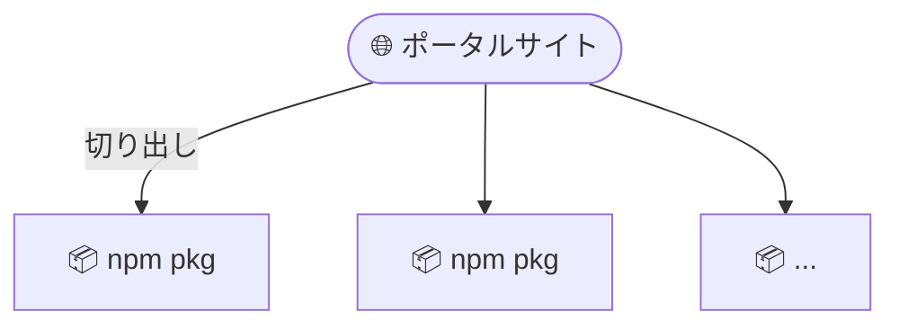
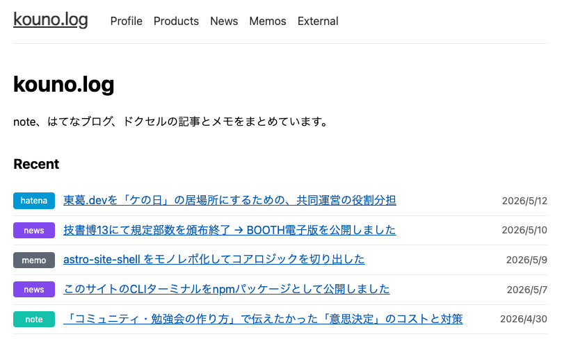
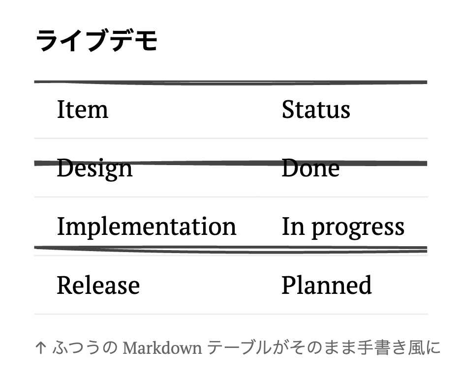

# 個人開発から切り出す<br>個人開発で一石二鳥しよう！

個人開発LT祭 2026年

<div class="mt-6 text-lg opacity-70">
「自分のために作ったもの」を「みんなのため」にも届ける
</div>

<div class="abs-br m-6 text-xl">
  <a href="https://kouno-log.pages.dev/" target="_blank" class="slidev-icon-btn">
    kouno-log.pages.dev
  </a>
</div>

---
transition: fade-out
---

# 自己紹介

<div class="grid grid-cols-2 gap-8 items-center">

<div>

## 河野 裕隆

虎の穴ラボ 通販チーム テックリード

<div class="mt-6 text-sm">

🐦 X: <a href="https://x.com/hk_it7" target="_blank">@hk_it7</a>

🌐 <a href="https://kouno-log.pages.dev/" target="_blank">kouno-log.pages.dev</a>

</div>

</div>

<div>

<div class="text-xs opacity-60 mb-2">📋 今日話すこと</div>

<div class="border border-gray-500 rounded p-4 text-sm space-y-2">

- 🌐 ポータルサイト中心の個人開発スタイル
- 📦 そこから切り出した npm パッケージ 2 つ
- 💡 切り出すための **設計のコツ**
- 🔁 dogfooding が生む "もう一個の個人開発"

</div>

</div>

</div>

---

# 何をしている人？

<div class="grid grid-cols-2 gap-8">

<div>

- ポータルサイトを作って、自分が欲しいと思ったものを開発している
- そして、開発した中で汎用的なものは **切り出して公開** している

</div>

<div>



</div>

</div>

---

# 一石二鳥とは？

<v-click>

- 自分が欲しいものを作る → **ポータルサイトが充実する**
- 汎用的な部分を切り出す → **OSSとして世に出る**
- ひとつの開発時間で **2つの成果物** が生まれる

</v-click>

<br>

<v-click>

> 「自分のために作ったもの」を「みんなのため」にも届ける

</v-click>

---
layout: section
---

# 紹介する個人開発

---
layout: two-cols
layoutClass: gap-8
---

# 1. ポータルサイト

母艦となるサイト

- URL: [kouno-log.pages.dev](https://kouno-log.pages.dev/)
- 自分のためのハブ
- ここで使うために部品を作る
- そしてその部品を npm に公開していく

::right::

<div class="mt-8 rounded-lg shadow-lg overflow-hidden border border-gray-500">
  
</div>

<div class="text-xs opacity-60 mt-2 text-center">
↑ ここで使った部品を切り出して公開
</div>

---

# 2. rough-table

HTMLテーブルのボーダーを **手書き風** に描画する vanilla JS ライブラリ

<div class="grid grid-cols-2 gap-6 mt-4">

<div>

**特徴**

- [Rough.js](https://roughjs.com/) を使った SVG オーバーレイ
- 元の `<table>` 要素の<br>**セマンティクスを壊さない**
- **テキスト選択も生きたまま** => コピペできる
- クラスを 1 つ追加するだけで動く

📦 [npmjs.com/package/rough-table](https://www.npmjs.com/package/rough-table)

</div>

<div>

**ライブデモ**

<RoughTable mode="solid" border="rows" :roughness="1.8">

| Item           | Status      |
| -------------- | ----------- |
| Design         | Done        |
| Implementation | In progress |
| Release        | Planned     |

</RoughTable>

<div class="text-xs opacity-60 mt-2">
↑ ふつうの Markdown テーブルがそのまま手書き風に
</div>

</div>

</div>

---

# rough-table のポイント

- 「ポータルサイトの表をちょっと味のある見た目にしたい」が出発点
- でも **アクセシビリティは絶対に犠牲にしたくなかった**
- → SVGオーバーレイ方式で `<table>` をそのまま活かす設計に
- 切り出して npm 公開 → 同じ悩みの人に届く

---

# 着想元: MacBook Neo の LP

<div class="text-xs opacity-70 -mt-2 mb-3">
🔗 <a href="https://www.apple.com/jp/macbook-neo/" target="_blank">apple.com/jp/macbook-neo/</a>
</div>

<div class="grid grid-cols-2 gap-6 mt-2 text-sm">

<div>

**Apple の "こんにちは、Neo。" の見せ方**

```html
<span class="gradient-text">
  <span class="html-copy">こんにちは、Neo。</span>
</span>
```

```css
mask-image: url(.../hero_text_mask.png);
```

- 見た目は **画像でピクセル制御**
- 中身は **実テキスト** (mask で隠す)
- → SEO・スクリーンリーダー・コピペ全部生きる

</div>

<div>

**rough-table の発想**

- 表を手書き風に**したい**
- でも `<table>` の <br>セマンティクスは**壊したくない**
- → 線だけ SVG で重ねて、<br>本体の `<table>` はそのまま

<v-click>

<div class="mt-6 p-3 border-l-4 border-blue-500 text-xs">

「装飾は別レイヤー / 本体は HTML のまま」<br>
**同じ哲学を別の領域に応用** した形

</div>

</v-click>

</div>

</div>

---

# 3. astro-site-shell

擬似的なターミナルをサイト上に作って **ナビゲーションできる** npm パッケージ

<div class="grid grid-cols-2 gap-6 mt-4">

<div>

**特徴**

- Astro 向けのコンポーネント
- ブラウザ上に "シェル風 UI"
- `cd` / `ls` のようなコマンドで<br>サイト内を遷移できる
- `help` でコマンド一覧、`sl` で SL も走る

📦 [npmjs.com/package/astro-site-shell](https://www.npmjs.com/package/astro-site-shell)

<div class="text-xs opacity-60 mt-2">
※ このスライド版は Slidev 用に Vue 移植
</div>

</div>

<div>

**ライブデモ** <span class="text-xs opacity-60">クリックして操作 →</span>

<CliTerminal
  prompt="lt2026@kouno"
  :pages="[
    { name: 'about',   url: 'https://kouno-log.pages.dev/about/',   title: 'プロフィール' },
    { name: 'contact', url: 'https://kouno-log.pages.dev/contact/', title: 'お問い合わせ' },
  ]"
  :collections="[
    {
      name: 'works',
      entries: [
        { name: 'rough-table',       url: 'https://www.npmjs.com/package/rough-table',       title: '手書き風テーブル', tags: ['npm','svg'] },
        { name: 'astro-site-shell',  url: 'https://www.npmjs.com/package/astro-site-shell',  title: 'ターミナルUI',     tags: ['npm','astro'] },
        { name: 'kouno-log',         url: 'https://kouno-log.pages.dev/',                    title: 'ポータルサイト',   tags: ['site'] },
      ]
    }
  ]"
/>

</div>

</div>

---

# astro-site-shell のポイント

- 「ポータルサイトの導線を、自分らしい見せ方にしたい」が出発点
  - サイトに面白さがなかったので、面白くしたかった
- 普通のナビではつまらない → **ターミナル UI** に
  - AIはCLIのほうが操作しやすいらしい → ならWebUIにCLIをつけてしまえというジョーク
- Astro のサイトに組み込みやすいよう切り出して公開
- ニッチだけど "刺さる人には刺さる" タイプの OSS

---

# おまけ: このスライド自体が "切り出し" の例

<v-click>

- 今出てきたターミナルは **Slidev (Vue)** で動いている
- 元の `astro-site-shell` は **Astro 用** のコンポーネント
- なのにこのスライドに乗っているのはなぜ？

</v-click>

<br>

<v-click>

→ **コアロジックがフレームワーク非依存** だったから

- Astro 固有なのは propsの受け取り方と `<script>` 構文だけ
- ファイルシステム / コマンド / 補完 / 履歴 は **全部 vanilla JS**
- Vueに移植するのは数十分、しかも今回の **LTスライド本体** がそのまま「もうひとつの切り出し」になった

</v-click>

<v-click>

→ 実際に [`site-shell-core`](https://www.npmjs.com/package/site-shell-core) **v0.2.0** として切り出して npm に公開しました<br>**（公開してすぐ、このスライドも依存させました）**

</v-click>

---
layout: section
---

# ここから少し<br>"学び" の話

<div class="text-sm opacity-70 mt-4">
自慢話で終わらせないために
</div>

---

# 個人開発の最強の強みは<br>**自分が一次ユーザー** であること

<div class="grid grid-cols-3 gap-4 mt-8 text-sm">

<div class="border border-gray-500 rounded p-3">

**業務開発**

作る人 ≠ 使う人

ニーズが伝聞になる

</div>

<div class="border border-gray-500 rounded p-3">

**多くの OSS**

作者 ≠ 主要ユーザー

メンテで疲弊しがち

</div>

<div class="border border-green-500 rounded p-3 bg-green-500/10">

**個人開発**

作る人 = 使う人

リアルなユースケースが<br>**手元にある**

</div>

</div>

<v-click>

<div class="mt-8 text-center">

→ ポータルサイトは **「ユースケースの源泉」** になる

</div>

</v-click>

---

# dogfooding は最強のテスト

<v-click>

- 自分のサイトで使う = 毎日 e2e テストしているのと同じ
- 別の文脈で使うと **想定外の境界条件** が出る
- 例: 今日まさに rough-table を Slidev に乗せたら<br>**`transform: scale()` 配下でズレるバグ** を発見

</v-click>

<v-click>

<div class="mt-6 p-4 border border-gray-500 rounded text-sm">

🐛 <a href="https://github.com/h-kono-it/rough-table/issues/1" target="_blank">github.com/h-kono-it/rough-table/issues/1</a>

LT準備中に見つけて、自分でissueを上げました<br>
**→ 即日 0.1.2 → 0.1.3 をリリース、このスライドも修正版に乗せ替えました**

</div>

</v-click>

<v-click>

<div class="mt-4 text-lg">

> **複数の場所で使う** = 自分が **多様なテスター** になれる

</div>

</v-click>

---

# Before / After: issue #1 の修正

<div class="grid grid-cols-2 gap-6 mt-4 text-sm">

<div>

**Before** — `rough-table@0.1.2`



<div class="text-xs opacity-70 mt-2">
SVG オーバーレイが <code>transform: scale()</code> 配下で<br>
本体テーブルと<strong>ズレて</strong>描画されている
</div>

</div>

<div>

**After** — `rough-table@0.1.3` <span class="text-xs opacity-60">← 今このスライドで動いてる</span>

<div class="mt-2">

<RoughTable mode="solid" border="rows" :roughness="1.8">

| Item           | Status      |
| -------------- | ----------- |
| Design         | Done        |
| Implementation | In progress |
| Release        | Planned     |

</RoughTable>

</div>

<div class="text-xs opacity-70 mt-2">
SVG に <code>viewBox</code> + <code>preserveAspectRatio</code> を設定するだけ。<br>
同じデータで枠線がセルに<strong>ピタリ</strong>と重なる
</div>

</div>

</div>

---

# 切り出しやすいコードの "型" 3つ

<div class="mb-4">

**① フレームワーク依存は "薄い殻" に閉じ込める**

中身は vanilla JS / 純粋関数。propsの受け取りと描画の入口だけが framework特化

<div class="text-xs opacity-70 mt-1">
さっきの <code>site-shell-core</code> + <code>astro-site-shell</code> の分割がまさにこれ。<br>
「Astro 用だから他では無理」と思い込みがちだが、今日の Vue 移植が <strong>20 分</strong> で終わったのはこれが効いた
</div>

</div>

<div class="mb-4">

**② "設定" は引数で受け取る**

グローバル変数や暗黙のimportに依存しない。<br>「呼び出し側が全部渡す」ようにすれば移植もテストも楽

</div>

<div class="mb-4">

**③ DOM・グローバルを汚さない / 後始末できる**

例: rough-table は元の `<table>` を一切書き換えず<br>SVGをオーバーレイするだけ → セマンティクスもaxe検査も無傷

</div>

---

# いつ切り出すか？

<div class="grid grid-cols-2 gap-8 mt-6">

<div>

**業務開発の定石**

<v-click at="1">

- 1回目: 普通に書く
- 2回目: コピペ＆少し違う
- 3回目: ようやく抽象化

→ "Rule of Three"<br>（早すぎる抽象化はYAGNI違反）

</v-click>

</div>

<div>

**個人開発の特権**

<v-click at="2">

- **2回目で切り出してもいい**
- 時間軸が長いから回収しやすい
- ハズレても傷が浅い
- そして切り出す = 公開して<br>**他人にも使ってもらえる**

<div class="mt-4 text-sm border-l-4 border-green-500 pl-3">

「業務でやると怒られる早めの抽象化」が<br>個人開発では戦略的に効く

</div>

</v-click>

</div>

</div>

---
layout: section
---

# まとめ

---

# 一石二鳥のすすめ

<v-click>

- ポータルサイトを **「実験場」** にする
- 自分の欲しい機能を作る → そのまま自分が使う
- 汎用化できる部分は **npm パッケージとして切り出す**
- 結果: **自分のサイトが育つ + OSS が増える**

</v-click>

<br>

<v-click>

## 個人開発から個人開発を産もう

</v-click>

---
layout: end
---

# ありがとうございました

<div class="mt-8 text-lg">

- 🌐 ポータル: [kouno-log.pages.dev](https://kouno-log.pages.dev/)
- 📦 [rough-table](https://www.npmjs.com/package/rough-table)
- 📦 [astro-site-shell](https://www.npmjs.com/package/astro-site-shell)

</div>
